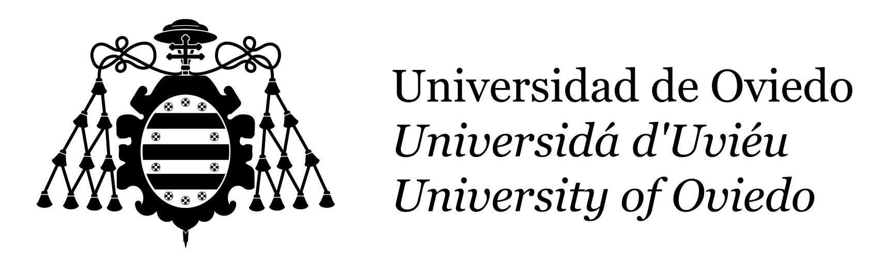

# Beca-Colaboracion-Uniovi-Scripts

Batería de scripts para facilitar las tareas a realizar por los becari@s que colaboran en la realización de servicios informáticos en Uniovi.

Entre estas tareas se pueden encontrar: 
   * Programar un autoapagado ([Wintel](Wintel/apagarPCEnHoras.bat) / [Unix](Unix/apagarPCenHoras.sh)).
   * Cambiar el nombre de un ordenador dentro de un dominio ([Wintel](Wintel/cambiarNombrePCDominio.bat)) o fuera de él ([Wintel](Wintel/cambiarNombrePC.bat)).
   * Guardar información de las características de un ordenador de cara a hacer un inventario ([Wintel](Wintel/guardarInfoPC.bat)).
   * Guardar información de IP de un ordenador de cara a hacer inventario o reusarla IP después de una reinstalación o reemplazo ([Wintel](Wintel/guardarInfoIP.bat)).
   * Guardar la key de activación de Windows para su uso en una reinstalación ([Wintel](Wintel/guardarKeyPC.bat)).
   * Resetear IP, para solventar problemas puntuales de conexión de red liberando primero la IP y solicitandola de nuevo (DHCP) ([Wintel](Wintel/resetearIP.bat)).
   * Recuperar USB afectado por el virus de "creación de accesos directos" de tipo [Recycler](https://es.wikipedia.org/wiki/Virus_inform%C3%A1tico#Tipos_de_virus) ([Wintel](Wintel/recuperarUSB.bat)).
   * Ver perfil WiFi de un ordenador para su futura reconfiguración ([Wintel](Wintel/verPerfilWifi.bat)).
   * Ver temperatura de CPU, para detectar posibles problemas de refrigeración del CPU de un ordenador ([Wintel](Wintel/verTemperaturaCPU.bat)).

# Autor
Marcelo Torrejón Manso - [@marcelotm23](https://github.com/marcelotm23) - 
